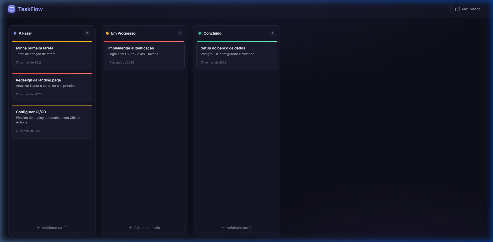
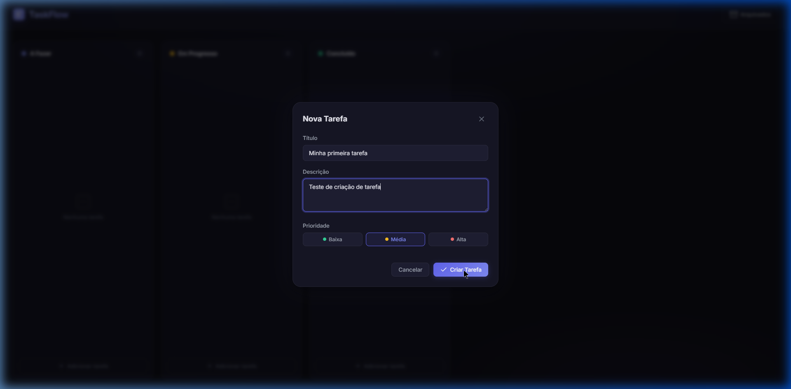

<div align="center">

# ✨ TaskFlow

### Gerenciamento de tarefas visual e intuitivo

Um aplicativo Kanban moderno inspirado no Trello, construído com **Node.js**, **Express** e **PostgreSQL**.

Organize, priorize e acompanhe suas tarefas em um quadro visual elegante com tema escuro.

<br/>



<br/>

[](https://nodejs.org/)
[](https://expressjs.com/)
[](https://www.postgresql.org/)
[](LICENSE)

</div>

---

## 🎯 Funcionalidades

<table>
<tr>
<td width="50%">

### 📋 Quadro Kanban
- **3 colunas** organizadas: A Fazer, Em Progresso, Concluído
- **Drag & Drop** para mover tarefas entre colunas
- Contagem de tarefas por coluna em tempo real
- Interface responsiva para desktop e mobile

</td>
<td width="50%">

### ⚡ Gestão de Tarefas
- **Criar** tarefas com título, descrição e prioridade
- **Editar** informações a qualquer momento
- **Excluir** com confirmação de segurança
- **Prioridades visuais**: Baixa 🟢 · Média 🟡 · Alta 🔴

</td>
</tr>
<tr>
<td width="50%">

### 📦 Sistema de Arquivamento
- **Arquivar** tarefas para limpar o quadro
- **Painel lateral** com tarefas arquivadas
- **Restaurar** tarefas ao quadro principal
- **Excluir permanentemente** do banco de dados

</td>
<td width="50%">

### 🎨 Design Premium
- Tema escuro com **glassmorphism**
- Micro-animações e transições suaves
- **Toast notifications** para feedback
- Atalhos de teclado (ESC para fechar)

</td>
</tr>
</table>

---

## 🖼️ Screenshots

<div align="center">

| Quadro Principal | Criação de Tarefa |
|:---:|:---:|
|  |  |

</div>

---

## 🚀 Início Rápido

### Pré-requisitos

- [Node.js](https://nodejs.org/) 18 ou superior
- [PostgreSQL](https://www.postgresql.org/download/) 14 ou superior

### 1. Clone o repositório

```bash
git clone https://github.com/seu-usuario/taskflow.git
cd taskflow
```

### 2. Instale as dependências

```bash
npm install
```

### 3. Configure o banco de dados

Crie um arquivo `.env` na raiz do projeto:

```env
DB_HOST=localhost
DB_PORT=5432
DB_USER=postgres
DB_PASSWORD=sua_senha_aqui
DB_NAME=taskflow
PORT=3000
```

### 4. Execute o seed do banco

Este comando cria o banco de dados, as tabelas e as colunas iniciais automaticamente:

```bash
npm run seed
```

### 5. Inicie o servidor

```bash
npm run dev
```

Acesse **[http://localhost:3000](http://localhost:3000)** no navegador 🎉

---

## 📁 Estrutura do Projeto

```
taskflow/
├── public/                  # Frontend
│   ├── index.html           # Página principal
│   ├── style.css            # Design system (tema escuro)
│   └── app.js               # Lógica do frontend
│
├── server/                  # Backend
│   ├── index.js             # Servidor Express
│   ├── db/
│   │   ├── schema.sql       # Schema do banco de dados
│   │   ├── connection.js    # Pool de conexões PostgreSQL
│   │   └── seed.js          # Script de inicialização
│   └── routes/
│       ├── tasks.js         # API REST de tarefas
│       └── columns.js       # API REST de colunas
│
├── docs/                    # Screenshots e documentação
├── .env                     # Variáveis de ambiente (não commitado)
├── .gitignore
├── package.json
└── README.md
```

---

## 🔌 API REST

### Tarefas

| Método | Endpoint | Descrição |
|:------:|----------|-----------|
| `GET` | `/api/tasks` | Listar tarefas ativas |
| `GET` | `/api/tasks/archived` | Listar tarefas arquivadas |
| `POST` | `/api/tasks` | Criar nova tarefa |
| `PUT` | `/api/tasks/:id` | Editar tarefa |
| `PUT` | `/api/tasks/:id/move` | Mover entre colunas |
| `PUT` | `/api/tasks/:id/archive` | Arquivar tarefa |
| `PUT` | `/api/tasks/:id/restore` | Restaurar do arquivo |
| `DELETE` | `/api/tasks/:id` | Excluir permanentemente |

### Colunas

| Método | Endpoint | Descrição |
|:------:|----------|-----------|
| `GET` | `/api/columns` | Listar colunas com tarefas |

### Health Check

| Método | Endpoint | Descrição |
|:------:|----------|-----------|
| `GET` | `/api/health` | Status do servidor |

---

## 🛠️ Tecnologias

<div align="center">

| Camada | Tecnologia | Propósito |
|--------|------------|-----------|
| **Frontend** | HTML + CSS + JS | Interface Kanban com drag-and-drop |
| **Backend** | Express.js | API REST e servidor estático |
| **Banco de Dados** | PostgreSQL | Armazenamento persistente |
| **Driver DB** | node-postgres (pg) | Conexão com PostgreSQL |
| **Tipografia** | Google Fonts (Inter) | Fonte moderna e legível |

</div>

---

## 📝 Scripts Disponíveis

```bash
npm run dev      # Inicia o servidor de desenvolvimento
npm run seed     # Cria o banco e executa o schema
npm start        # Inicia o servidor em produção
```

---

## 🤝 Contribuindo

1. Faça um fork do projeto
2. Crie uma branch para sua feature (`git checkout -b feature/minha-feature`)
3. Commit suas mudanças (`git commit -m 'feat: minha nova feature'`)
4. Push para a branch (`git push origin feature/minha-feature`)
5. Abra um Pull Request

---

## 📄 Licença

Este projeto está sob a licença MIT. Veja o arquivo [LICENSE](LICENSE) para mais detalhes.

---

<div align="center">

Feito com 💜 usando Node.js + PostgreSQL

</div>
